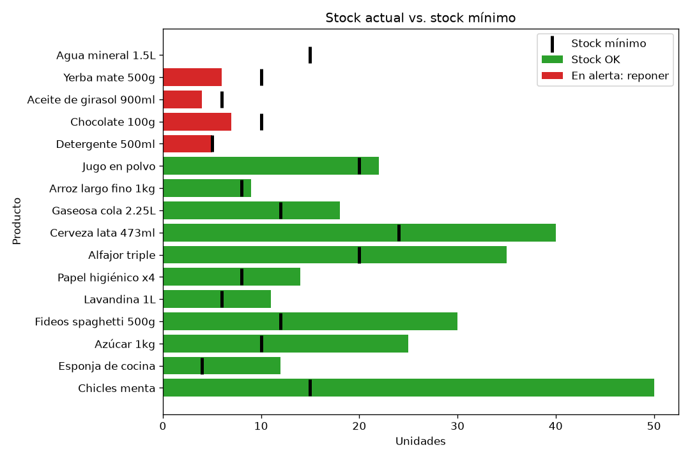

# Control de inventario y alertas de reabastecimiento

Trabajo Práctico 1 · Elementos de Programación IA y Low Code · 2C2026

## Objetivo

Una app de consola en Python para un almacén o kiosco. Registra productos y movimientos de stock, avisa qué hay que reponer, cuánto pedir y cuánto cuesta, y calcula indicadores con pandas: valor del inventario, días de cobertura y más vendidos. También genera gráficos con matplotlib y consulta la cotización del dólar en una API pública para valuar el stock en dólares.



## Instalación

Requiere Python 3.12 o superior.

```bash
python -m venv .venv
source .venv/Scripts/activate      # Windows (Git Bash)
# .venv\Scripts\activate           # Windows (cmd o PowerShell)
# source .venv/bin/activate        # Linux o Mac
pip install -r requirements.txt
```

## Ejecución

```bash
python main.py                                   # la app (menú interactivo)
pytest -q                                        # tests automáticos
python main.py < tests/smoke_input.txt           # recorrido automático del menú
jupyter notebook analisis.ipynb                  # notebook de análisis
```

Al arrancar, la app avisa cuántos productos hay para reponer. El menú tiene estas opciones:

| Opción | Qué hace |
|---|---|
| 1 · 2 · 3 | Listar, buscar (por código o parte del nombre) y filtrar por categoría |
| 4 · 5 · 6 | Agregar, modificar y eliminar productos |
| 7 · 8 · 9 | Registrar entradas y salidas de stock, ver el historial |
| 10 · 11 | Ver alertas de reposición y exportar la orden de compra a CSV |
| 12 | Ver indicadores (pandas) |
| 13 | Generar gráficos (matplotlib) |
| 14 | Valor del inventario en dólares (cotización online) |

Para volver a los datos de ejemplo después de probar: `git checkout datos/`.

## Estructura de archivos

| Archivo | Capa | Qué contiene |
|---|---|---|
| `main.py` | Presentación | Menú, lectura de datos por teclado y tablas en pantalla. No tiene lógica de negocio. |
| `inventario.py` | Dominio | Clase `Inventario`: búsquedas, altas, modificaciones, movimientos de stock y alertas. |
| `modelos.py` | Modelos | Clases `Producto` y `Movimiento`, que validan sus datos, y la excepción `ErrorInventario`. |
| `persistencia.py` | Datos | Lectura y escritura de JSON y CSV. Es el único módulo que abre archivos. |
| `fuente_externa.py` | Datos | Cotización del dólar desde la API, con respaldo en caché. Es el único módulo que usa la red. |
| `analisis.py` | Análisis | Indicadores con pandas y gráficos con matplotlib. Lo usan `main.py` y la notebook. |
| `analisis.ipynb` | | Exploración de los datos, indicadores, gráficos y conclusiones. |
| `datos/` | | `productos.json`, `movimientos.csv`, `cotizacion.json` y `orden_compra.csv` (generada). |
| `graficos/` | | PNG generados por la app. |
| `tests/` | | 77 tests con pytest y la entrada del smoke. |
| `docs/guia.md` | | Guía para entender el código. |
| `docs/registro_prompts.md` | | Registro del uso de IA. |

## Datos

**Productos** (`datos/productos.json`). Es una lista de objetos:

```json
{"codigo": "A001", "nombre": "Yerba mate 500g", "categoria": "almacen", "precio": 2500.0, "stock": 6, "stock_minimo": 10}
```

**Movimientos** (`datos/movimientos.csv`). Es el historial de entradas y salidas, y solo crece:

```
fecha,codigo,tipo,cantidad
2026-09-20,A001,salida,4
```

Los datos de ejemplo son 16 productos en 4 categorías y 72 movimientos de 30 días. Están armados para que haya productos en alerta, uno sin stock y uno sin ventas.

## Fuente externa

`fuente_externa.py` consulta [DolarApi](https://dolarapi.com), que es gratuita y no pide clave. La consulta es `GET https://dolarapi.com/v1/dolares/oficial`, y se usa el valor de **venta** para expresar en dólares el valor del inventario y el costo de reposición (opción 14 y notebook).

Si no hay internet o la API falla, la app usa la última cotización guardada en `datos/cotizacion.json` y avisa que es la guardada. El pedido tiene un timeout de 5 segundos, para que el menú nunca quede colgado.

## Alertas e indicadores

- **Alerta de reposición.** Un producto está en alerta cuando su stock es **menor o igual** a su stock mínimo. Se sugiere pedir lo necesario para llegar al **doble del mínimo** (`stock_minimo * 2 - stock`), y se calcula el costo con el precio actual. Las alertas se ordenan por urgencia: primero los productos sin stock.
- **Indicador 1 · valor del inventario.** Es la plata inmovilizada en stock (precio × stock), total y por categoría.
- **Indicador 2 · días de cobertura.** El consumo diario son las unidades vendidas en los últimos 30 días divididas por 30. La cobertura es el stock dividido el consumo diario: cuántos días dura lo que hay al ritmo actual.
- **Indicador 3 · más vendidos.** Es el ranking de unidades vendidas en los últimos 30 días.
- **Extra · sin ventas.** Son los productos con stock que no se vendieron en 30 días.

Los "últimos 30 días" se cuentan desde el último movimiento registrado, no desde hoy.

## Decisiones principales

- **POO aunque no esté en el programa de la cursada.** El problema tiene tres conceptos (producto, movimiento, inventario) y cada clase junta sus datos con sus reglas. Se usó solo lo básico: `__init__`, atributos y métodos, sin herencia salvo la excepción propia.
- **Cinco módulos en capas en vez de `main.py` + `funciones.py`.** Cada módulo tiene una sola responsabilidad y se explica en una frase. La pantalla no tiene lógica, así que la lógica se testea sin teclado y la notebook la reutiliza.
- **Los modelos validan en el constructor y lanzan `ErrorInventario`.** Un objeto inválido no puede existir. `main.py` atrapa todos los errores de negocio en un solo `try/except`.
- **El stock solo cambia con movimientos.** Queda registro de todo cambio, y una salida nunca deja stock negativo.
- **JSON para productos, CSV para movimientos.** Los productos se reescriben enteros. Los movimientos son un historial que solo se agrega, y pandas lo lee directo.
- **Indicadores relativos al último movimiento.** Así no quedan vacíos si la app no se usa por un tiempo.
- **API con caché.** La demo funciona sin internet, y la API no se llama en los tests: se simula con `monkeypatch`.

El detalle de cada decisión está en `docs/decisions.md`.

## Uso de IA

El proyecto se desarrolló con **Claude Code** como asistente. Primero se escribieron las especificaciones por feature (`specs/`), con criterios de aceptación y cómo verificar cada una. Después la IA implementó story por story, con tests y un commit por story, y cada decisión quedó registrada.

Los prompts relevantes, qué se aceptó, modificó o rechazó y cómo se verificó están en [`docs/registro_prompts.md`](docs/registro_prompts.md).

## Cómo se probó

- **Tests automáticos:** 77 tests con pytest (`pytest -q`) sobre modelos, inventario, persistencia, análisis y fuente externa. Cubren casos normales, límite e inválidos. Los archivos se prueban en carpetas temporales y la API se simula.
- **Smoke:** `python main.py < tests/smoke_input.txt` recorre todas las opciones de consulta del menú sin intervención.
- **Notebook:** se ejecuta completa con `jupyter nbconvert --to notebook --execute --inplace analisis.ipynb`.
- **Casos manuales:**

| Caso | Entrada | Esperado |
|---|---|---|
| Salida válida | Opción 8, `A002`, `15` | Stock de 25 a 10 y aviso de alerta |
| Salida inválida | Opción 8, `A002`, `999` | "Stock insuficiente..." y el stock no cambia |
| Dato inválido | Opción 4, precio `abc` | Repregunta el precio |
| Límite | Opción 10 | Detergente (stock 5 = mínimo 5) aparece en alerta |
| Sin internet | Opción 14 sin wifi | Usa la cotización guardada y lo avisa |

## Cómo entender el código

[`docs/guia.md`](docs/guia.md) explica la arquitectura, recorre paso a paso qué pasa al registrar una venta y describe cada módulo, clase y función. También incluye la tabla de errores, los conceptos de Python usados y las preguntas probables del oral.

## Limitaciones

- Es para un solo usuario y un solo almacén. No hay usuarios ni permisos.
- Guardar un movimiento escribe dos archivos. Si falla el segundo, quedan desincronizados.
- La búsqueda no ignora tildes: "cafe" no encuentra "Café".
- El stock mínimo es fijo. No se ajusta según la velocidad de venta.
- Los precios no tienen historial: el valor del inventario usa el precio actual.
